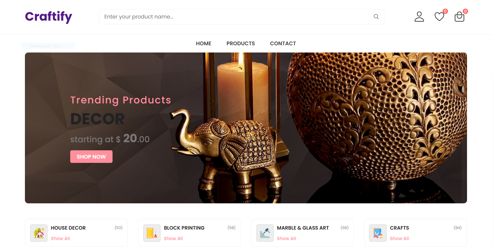

# Craftify - an Handmade Crafts Store

Craftify is a fully responsive ecommerce website, maximum compatiblities in all mobile devices, built using HTML, CSS, and JavaScript.

## Demo




## Prerequisites

Before you begin, ensure you have met the following requirements:

* [Git](https://git-scm.com/downloads "Download Git") must be installed on your operating system.

## Installing Craftify

To install **Craftify**, follow these steps:

Linux and macOS:

```bash
sudo git clone https://github.com/Rihan2710/Maersk-Task-WCE.git
```

Windows:

```bash
git clone https://github.com/Rihan2710/Maersk-Task-WCE.git
```

## Contact

If you want to contact me you can reach me at [Gmail](rihannardekar2710@gmail.com).

## License

This project is **free to use** and does not contains any license.
